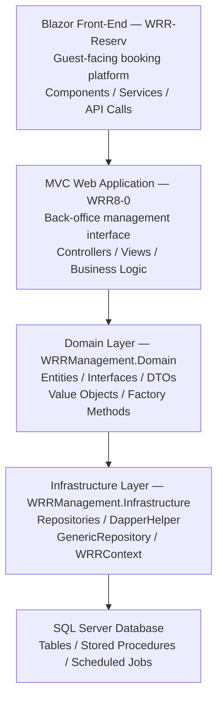

# WeRentRooms (WRR) — Hotel Management Platform

A multi-tenant SaaS hotel management platform built for independent hotel operators. WeRentRooms handles the full lifecycle of hotel operations, from guest-facing online booking through back-office management, reporting, and property maintenance.

Built and maintained over a decade as a production system serving live hotel properties.

---

## Overview

WeRentRooms was designed from the ground up to solve the day-to-day operational challenges that independent hotels face. Rather than adapting an enterprise system, WRR was purpose-built around the workflows of small property operators — prioritizing simplicity, reliability, and real-time data visibility.

The platform has been migrated through three technology generations:

```
.NET 2.0  →  ASP.NET MVC 5  →  ASP.NET Core (.NET 9)
```

Each migration maintained production stability and was paired with architectural improvements, including a full refactor to clean architecture and domain-driven design principles.

---

## Features

**Reservations & Booking**
- Guest-facing online booking built as a standalone Blazor Server application
- Real-time room availability checks without full page reloads
- Reservation creation, modification, and rollback logic
- Calendar-based booking interface with drag-and-drop room allocation
- Package and rate allocation per room type

**Rate & Inventory Management**
- Flexible rate management with date range controls
- Rack rate overlap validation to prevent conflicts
- Promotional rate and discount rule support
- Room inventory tracking across property types

**Administration**
- Multi-tenant architecture supporting multiple independent properties
- Role-based access control for managers, front desk staff, and guests
- .NET Identity integration for authentication and authorization
- Admin dashboard with reporting and occupancy analytics

**Property Maintenance**
- Web-based maintenance request logging and tracking
- Real-time status updates accessible from tablets on property
- Repair history per asset for pattern identification
- Task assignment and resolution tracking for property staff

**Data & Reporting**
- SQL Server backend with stored procedures for all data access
- Scheduled SQL Agent jobs for automated data scrubbing and maintenance
- Reporting across reservations, occupancy, revenue, and maintenance history
- Azure Blob Storage integration for image management

---

## Tech Stack

| Layer | Technology |
|---|---|
| Backend | ASP.NET Core, C#, .NET 9 |
| Frontend | Blazor Server, Razor, HTML5, Bootstrap, JavaScript |
| Data Access | Dapper, ADO.NET, Entity Framework Core (migrations) |
| Database | SQL Server, T-SQL, Stored Procedures |
| Authentication | ASP.NET Core Identity, Role-Based Authorization |
| Architecture | Clean Architecture, Domain-Driven Design |
| Storage | Azure Blob Storage |
| DevOps | GitHub Actions, IIS, Azure App Service |

---

## Architecture

The solution follows a clean architecture pattern with clear separation across four layers:



**Design decisions:**
- Repository pattern with a `DapperRepository` base class handles all data access
- Domain entities use private setters and factory methods to enforce business rules
- Value objects (e.g., `DateRange`, `GuestCount`) encapsulate domain logic
- Interfaces defined in the Domain layer keep Infrastructure dependencies inverted
- Dapper used for all queries; EF Core used only for code-first migrations

---

## Project Structure

```
WRRManagement/
├── WRR-Hotel.sln                        # Solution file
├── WRR8-0/                              # MVC back-office application
│   ├── Areas/Identity/                  # ASP.NET Identity user management
│   ├── Components/                      # Razor components
│   ├── Controllers/                     # MVC and API controllers
│   ├── Models/                          # View models and entities
│   └── Views/                           # Razor views (.cshtml)
├── WRRManagement.Domain/                # Core domain layer
│   ├── Entities/                        # Domain entities with DDD patterns
│   ├── Interfaces/                      # Repository and service contracts
│   ├── ValueObjects/                    # DateRange, GuestCount, etc.
│   └── DTOs/                            # Data transfer objects
├── WRRManagement.Infrastructure/        # Data access layer
│   ├── Repositories/                    # Dapper repository implementations
│   ├── DapperHelper/                    # SQL connection and query helpers
│   └── WRRContext/                      # EF Core context (migrations only)
├── WRR-Reserv/                          # Blazor Server booking platform
│   ├── Pages/                           # Razor pages and components
│   ├── ViewModels/                      # Data binding models
│   └── Services/                        # C# service classes
├── Sql-database/                        # Database schema and stored procedures
└── README.md
```

---

## Notes

This repository contains a representative portion of the platform for portfolio purposes. The full production codebase includes additional modules not shown here. Code is provided for viewing and review only.

---

## License

Copyright 2025 Karla Cooper. All rights reserved.

This source code is provided for viewing purposes only. No permission is granted to use, copy, modify, distribute, or sublicense any part of this code without explicit written consent.
